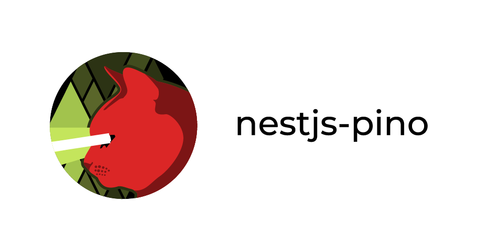

<p align="center">
  
</p>

<h1 align="center">NestJS-Pino</h1>

<p align="center">
  <a href="https://www.npmjs.com/package/nestjs-pino">
    
  </a>
  <a href="https://travis-ci.org/iamolegga/nestjs-pino">
    
  </a>
  <a href="https://coveralls.io/github/iamolegga/nestjs-pino?branch=master">
    
  </a>
  <a href="https://snyk.io/test/github/iamolegga/nestjs-pino">
    
  </a>
  
  
  
</p>

<p align="center">✨✨✨ Platform agnostic logger for NestJS based on Pino with <b>REQUEST CONTEXT IN EVERY LOG</b> ✨✨✨</p>

## Example

Import module:

```ts
import { LoggerModule } from 'nestjs-pino';

@Module({
  imports: [LoggerModule.forRoot()],
  controllers: [AppController],
  providers: [MyService]
})
class MyModule {}
```

In controller:

```ts
import { Logger } from 'nestjs-pino';

@Controller()
export class AppController {
  constructor(
    private readonly myService: MyService,
    private readonly logger: Logger
  ) {}

  @Get()
  getHello(): string {
    this.logger.log("getHello()", AppController.name);
    return `Hello ${this.myService.getWorld()}`;
  }
}
```

In service:

```ts
import { Logger } from 'nestjs-pino';

@Injectable()
export class MyService {
  constructor(private readonly logger: Logger) {}

  getWorld(...params: any[]) {
    this.logger.log("getWorld(%o)", MyService.name, params);
    return "World!";
  }
}
```

Output:

```json
// Logs by Nest itself, when set `app.useLogger(app.get(Logger))`
{"level":30,"time":1570470154387,"pid":17383,"hostname":"my-host","context":"RoutesResolver","msg":"AppController {/}: true","v":1}
{"level":30,"time":1570470154391,"pid":17383,"hostname":"my-host","context":"RouterExplorer","msg":"Mapped {/, GET} route true","v":1}
{"level":30,"time":1570470154405,"pid":17383,"hostname":"my-host","context":"NestApplication","msg":"Nest application successfully started true","v":1}

// Logs by injected Logger methods in Services/Controllers
// Every log has it's request data
{"level":30,"time":1570470161805,"pid":17383,"hostname":"my-host","req":{"id":1,"method":"GET","url":"/","headers":{...},"remoteAddress":"::1","remotePort":53957},"context":"AppController","msg":"getHello()","v":1}
{"level":30,"time":1570470161805,"pid":17383,"hostname":"my-host","req":{"id":1,"method":"GET","url":"/","headers":{...},"remoteAddress":"::1","remotePort":53957},"context":"MyService","msg":"getWorld([])","v":1}

// Automatic logs of every request/response
{"level":30,"time":1570470161819,"pid":17383,"hostname":"my-host","req":{"id":1,"method":"GET","url":"/","headers":{...},"remoteAddress":"::1","remotePort":53957},"res":{"statusCode":304,"headers":{...}},"responseTime":15,"msg":"request completed","v":1}
```

## Comparison with others

There are other Nestjs loggers. The key purposes of this one are:
  - to be compatible with built-in `LoggerService`
  - to log with JSON (thanks to `pino` - [super fast logger](https://github.com/pinojs/pino/blob/master/docs/benchmarks.md)) ([why JSON?](https://jahed.dev/2018/07/05/always-log-to-json/))
  - to log every request/response automatically (thanks to `pino-http`)
  - to bind request data to the logs automatically from any service on any application layer without passing request context

| Logger             | Nest App logger | Logger service | Autobind request data to logs |
| ------------------ | :-------------: | :------------: | :---------------------------: |
| nest-morgan        |        -        |       -        |               -               |
| nest-winston       |        +        |       +        |               -               |
| nestjs-pino-logger |        +        |       +        |               -               |
| __nestjs-pino__    |        +        |       +        |               +               |

## Install

```sh
npm i nestjs-pino
```

## Register module

### Default params

Just import `LoggerModule` to your module:

```ts
import { LoggerModule } from 'nestjs-pino';

@Module({
  imports: [LoggerModule.forRoot()],
  ...
})
class MyModule {}
```

### Synchronous configuration

`LoggerModule.forRoot` has the same API as [pino-http](https://github.com/pinojs/pino-http#pinohttpopts-stream):

```ts
import { LoggerModule } from 'nestjs-pino';

@Module({
  imports: [
    LoggerModule.forRoot(
      {
        name: 'add some name to every JSON line',
        level: process.env.NODE_ENV !== 'production' ? 'debug' : 'info',
        prettyPrint: process.env.NODE_ENV !== 'production',
        useLevelLabels: true,
        // and all the others...
      },
      someWritableStream
    )
  ],
  ...
})
class MyModule {}
```


### Asynchronous configuration

With `LoggerModule.forRootAsync` you can, for example, import your `ConfigModule` and inject `ConfigService` to use it in `useFactory` method.

`useFactory` should return either:
- `null`
- or `typeof arguments` of [pino-http](https://github.com/pinojs/pino-http#pinohttpopts-stream)
- or `Promise` of it

Here's an example:

```ts
import { LoggerModule } from 'nestjs-pino';

@Injectable()
class ConfigService {
  public readonly level = "debug";
}

@Module({
  providers: [ConfigService],
  exports: [ConfigService]
})
class ConfigModule {}

@Module({
  imports: [
    LoggerModule.forRootAsync({
      imports: [ConfigModule],
      inject: [ConfigService],
      useFactory: async (config: ConfigService) => {
        await somePromise();
        return { level: config.level };
      }
    })
  ],
  ...
})
class TestModule {}
```

Or you can just pass `ConfigService` to `providers`, if you don't have any `ConfigModule`:

```ts
import { LoggerModule } from 'nestjs-pino';

@Injectable()
class ConfigService {
  public readonly level = "debug";
  public readonly stream = stream;
}

@Module({
  imports: [
    LoggerModule.forRootAsync({
      providers: [ConfigService],
      inject: [ConfigService],
      useFactory: (config: ConfigService) => {
        return [{ level: config.level }, config.stream];
      }
    })
  ],
  controllers: [TestController]
})
class TestModule {}
```

### Extreme mode
> In essence, `extreme` mode enables even faster performance by Pino.

Please, read [pino extreme mode docs](https://github.com/pinojs/pino/blob/master/docs/extreme.md#extreme-mode) first. There is a risk of some logs being lost, but you can [minimize it](https://github.com/pinojs/pino/blob/master/docs/extreme.md#log-loss-prevention).

If you know what you're doing, you can enable it like so:

```ts
import * as pino from 'pino';
import { LoggerModule } from 'nestjs-pino';

const dest = pino.extreme();
const logger = pino(dest);

@Module({
  imports: [LoggerModule.forRoot({ logger })],
  ...
})
class MyModule {}
```

## Usage as Logger service

`Logger` implements standard NestJS `LoggerService` interface. So if you are familiar with [built-in NestJS logger](https://docs.nestjs.com/techniques/logger), you are good to go.

```ts
// my.service.ts
import { Logger } from 'nestjs-pino';

@Injectable()
export class MyService {
  constructor(private readonly logger: Logger) {}

  getWorld(...params: any[]) {
    this.logger.log("getWorld(%o)", MyService.name, params);
    return "World!";
  }
}
```

## Usage as NestJS app logger

According to [official docs](https://docs.nestjs.com/techniques/logger#dependency-injection), loggers with Dependency injection should be set via following construction:

```ts
import { Logger } from 'nestjs-pino';

const app = await NestFactory.create(MyModule, { logger: false });
app.useLogger(app.get(Logger));
```

## FAQ

__Q__: _How does it work?_

__A__: It uses [pino-http](https://github.com/pinojs/pino-http) under hood, so every request has it's own [child-logger](https://github.com/pinojs/pino/blob/master/docs/child-loggers.md), and with help of [async_hooks](https://nodejs.org/api/async_hooks.html) `Logger` can get it while calling own methods. So your logs can be grouped by `req.id`.

__Q__: _Why use [async_hooks](https://nodejs.org/api/async_hooks.html) instead of [REQUEST scope](https://docs.nestjs.com/fundamentals/injection-scopes#per-request-injection)?_

__A__: [REQUEST scope](https://docs.nestjs.com/fundamentals/injection-scopes#per-request-injection) can have [perfomance issues](https://docs.nestjs.com/fundamentals/injection-scopes#performance). TL;DR: it will have to create an instance of the class (that injects `Logger`) on each request, and that will slow down your responce times.

__Q__: _I'm using old nodejs version, will it work for me?_

__A__: Please read [this](https://github.com/jeff-lewis/cls-hooked#continuation-local-storage--hooked-).

__Q__: _What about pino built-in methods/levels?_

__A__: Pino built-in methods are not compatible with NestJS built-in `LoggerService` methods. Decision was made to support the latter and map them accordingly:

| pino    | LoggerService |
| ------- | ------------- |
| `trace` | `verbose`     |
| `debug` | `debug`       |
| `info`  | `log`         |
| `warn`  | `warn`        |
| `error` | `error`       |
